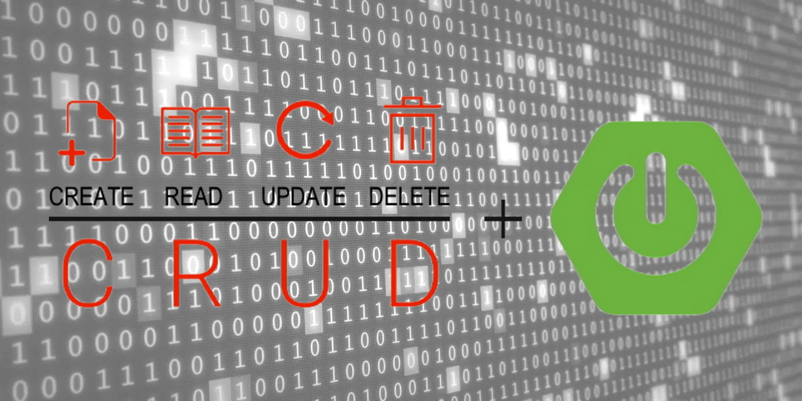

# Spring Boot Banking REST API 🏦


## Introduction

### About This Banking System
This is a comprehensive **Spring Boot** REST API designed specifically for UK financial services companies. The system provides core banking functionalities including customer management, account operations, and transaction processing, all compliant with UK banking standards and regulations.

### Key Banking Features
- **Customer Management**: Complete CRUD operations for customer data with UK-specific validations
- **Account Operations**: Support for multiple account types (Current, Savings, ISA, Business, Joint)
- **Transaction Processing**: Secure transaction handling with real-time balance updates
- **UK Compliance**: Validation for UK phone numbers, postcodes, and National Insurance numbers
- **Audit Trail**: Complete transaction history and audit logging
- **Security**: Account freezing, transaction limits, and fraud prevention measures

### Banking Domain Entities
- **Customer**: UK residents with validated personal information
- **Bank Account**: Various account types with UK sort codes and account numbers
- **Transaction**: Comprehensive transaction records with multiple transaction types

## Project Structure
This banking system follows the **MVC (Model View Controller)** pattern with additional service and repository layers for clean architecture:

- [📁 application](src/main/java/br/com/example/davidarchanjo/application): Main Spring Boot application entry point
- [📁 builder](src/main/java/br/com/example/davidarchanjo/builder): Entity-DTO conversion utilities for banking objects
- [📁 config](src/main/java/br/com/example/davidarchanjo/config): Spring configuration classes and beans
- [📁 controller](src/main/java/br/com/example/davidarchanjo/controller): REST API endpoints for banking operations
- [📁 exception](src/main/java/br/com/example/davidarchanjo/exception): Banking-specific exceptions and error handling
- [📁 domain](src/main/java/br/com/example/davidarchanjo/model/domain): Banking entities (Customer, BankAccount, Transaction)
- [📁 dto](src/main/java/br/com/example/davidarchanjo/model/dto): Data transfer objects for API operations
- [📁 repository](src/main/java/br/com/example/davidarchanjo/repository): Data access layer with banking-specific queries
- [📁 service](src/main/java/br/com/example/davidarchanjo/service): Business logic for banking operations

## Prerequisites
- Maven 3+
- Java 8+

## Libraries and Dependencies
- [Spring Web](https://docs.spring.io/spring-framework/docs/current/reference/html/web.html) - REST API framework
- [Spring Data JPA](https://spring.io/projects/spring-data-jpa) - Database operations
- [Spring Validation](https://docs.spring.io/spring-framework/docs/current/reference/html/core.html#validation) - UK-compliant data validation
- [JUnit 5](https://junit.org/junit5/) - Testing framework
- [Mockito](https://site.mockito.org/) - Mocking framework
- [H2 Database](https://www.h2database.com/html/main.html) - In-memory database
- [Lombok](https://projectlombok.org/) - Boilerplate code reduction
- [ModelMapper](http://modelmapper.org/) - Object mapping
- [JavaFaker](https://github.com/DiUS/java-faker) - UK-compliant test data generation

## Banking API Endpoints

### Customer Management
- `POST /api/v1/customers` - Create new customer
- `GET /api/v1/customers` - Get all customers
- `GET /api/v1/customers/{id}` - Get customer by ID
- `GET /api/v1/customers/search?name={name}` - Search customers by name
- `GET /api/v1/customers/email/{email}` - Get customer by email
- `GET /api/v1/customers/status/{status}` - Get customers by status
- `PUT /api/v1/customers/{id}` - Update customer
- `DELETE /api/v1/customers/{id}` - Delete customer
- `POST /api/v1/customers/populate` - Generate test customers

### Account Management
- `POST /api/v1/accounts` - Create new bank account
- `GET /api/v1/accounts` - Get all accounts
- `GET /api/v1/accounts/{id}` - Get account by ID
- `GET /api/v1/accounts/customer/{customerId}` - Get customer accounts
- `GET /api/v1/accounts/search?accountNumber={number}&sortCode={code}` - Find account
- `GET /api/v1/accounts/{id}/balance` - Get account balance
- `GET /api/v1/accounts/low-balance?threshold={amount}` - Get low balance accounts
- `PUT /api/v1/accounts/{id}` - Update account
- `PATCH /api/v1/accounts/{id}/freeze` - Freeze account
- `PATCH /api/v1/accounts/{id}/unfreeze` - Unfreeze account
- `DELETE /api/v1/accounts/{id}` - Close account
- `POST /api/v1/accounts/populate` - Generate test accounts

### Transaction Processing
- `POST /api/v1/transactions` - Process transaction
- `POST /api/v1/transactions/transfer` - Transfer money between accounts
- `POST /api/v1/transactions/deposit` - Deposit money
- `POST /api/v1/transactions/withdraw` - Withdraw money
- `GET /api/v1/transactions` - Get all transactions
- `GET /api/v1/transactions/{id}` - Get transaction by ID
- `GET /api/v1/transactions/reference/{reference}` - Get transaction by reference
- `GET /api/v1/transactions/account/{accountId}` - Get account transactions
- `GET /api/v1/transactions/customer/{customerId}` - Get customer transactions
- `GET /api/v1/transactions/account/{accountId}/date-range` - Get transactions by date range
- `GET /api/v1/transactions/account/{accountId}/balance` - Get current balance
- `GET /api/v1/transactions/account/{accountId}/large?minAmount={amount}` - Get large transactions
- `PATCH /api/v1/transactions/{id}/cancel` - Cancel transaction
- `POST /api/v1/transactions/populate` - Generate test transactions

## UK Banking Compliance Features

### Customer Data Validation
- **Phone Numbers**: UK format validation (+44xxxxxxxxxx)
- **Postcodes**: UK postcode format validation
- **National Insurance Numbers**: UK NI number format validation (2 letters, 6 digits, 1 letter)
- **Email**: Standard email validation
- **Age Verification**: Date of birth validation for legal age requirements

### Account Features
- **UK Sort Codes**: Standard 6-digit sort codes (40-00-01 for our bank)
- **Account Numbers**: 8-digit account numbers with uniqueness validation
- **Account Types**: Current, Savings, ISA, Business, and Joint accounts
- **Overdraft Management**: Configurable overdraft limits
- **Interest Rates**: Account-specific interest rate management

### Transaction Types
- **Deposits**: Cash and electronic deposits
- **Withdrawals**: ATM and branch withdrawals
- **Transfers**: Internal and external transfers
- **Direct Debits**: Automated payment processing
- **Standing Orders**: Recurring payment setup
- **Card Payments**: Debit and credit card transactions
- **Interest Credits**: Automatic interest calculations
- **Fee Debits**: Account maintenance and transaction fees

## Getting Started

### 1. Clone the Repository
```bash
git clone https://github.com/sunitakumari11112002-boop/spring-boot-rest.git
cd spring-boot-rest
```

### 2. Build the Project
```bash
mvn clean install
```

### 3. Run the Application
```bash
mvn spring-boot:run
```

### 4. Access the API
- **Base URL**: http://localhost:8080
- **H2 Console**: http://localhost:8080/h2-console
- **API Documentation**: Available through the REST endpoints listed above

### 5. Populate Test Data
```bash
# Create test customers
POST http://localhost:8080/api/v1/customers/populate

# Create test accounts
POST http://localhost:8080/api/v1/accounts/populate

# Create test transactions
POST http://localhost:8080/api/v1/transactions/populate
```

## Example Usage

### Create a New Customer
```json
POST /api/v1/customers
{
    "firstName": "John",
    "lastName": "Smith",
    "email": "john.smith@example.com",
    "phoneNumber": "+447911123456",
    "dateOfBirth": "1985-06-15",
    "address": "123 High Street, London",
    "postcode": "SW1A 1AA",
    "nationalInsuranceNumber": "AB123456C"
}
```

### Create a Bank Account
```json
POST /api/v1/accounts
{
    "accountType": "CURRENT",
    "initialDeposit": 1000.00,
    "overdraftLimit": 500.00,
    "customerId": 1
}
```

### Transfer Money
```bash
POST /api/v1/transactions/transfer?fromAccountId=1&toAccountNumber=87654321&toSortCode=40-00-01&amount=250.00&reference=Rent&payeeName=Landlord
```

## Database Schema
The system uses H2 in-memory database with the following main tables:
- **customers**: Customer personal information
- **bank_accounts**: Account details and balances
- **transactions**: Transaction records and audit trail

## Security Features
- Account status management (Active, Frozen, Closed)
- Transaction validation and fraud prevention
- Balance and overdraft limit enforcement
- Audit trail for all operations
- Input validation for UK-specific data formats

## Testing
Run the test suite:
```bash
mvn test
```

## Contributing
This project is designed for UK financial services. When contributing:
1. Ensure UK banking compliance
2. Follow the existing architecture pattern
3. Add appropriate validation for financial data
4. Include comprehensive tests
5. Update documentation for new features

## License
This project is licensed under the MIT License.
